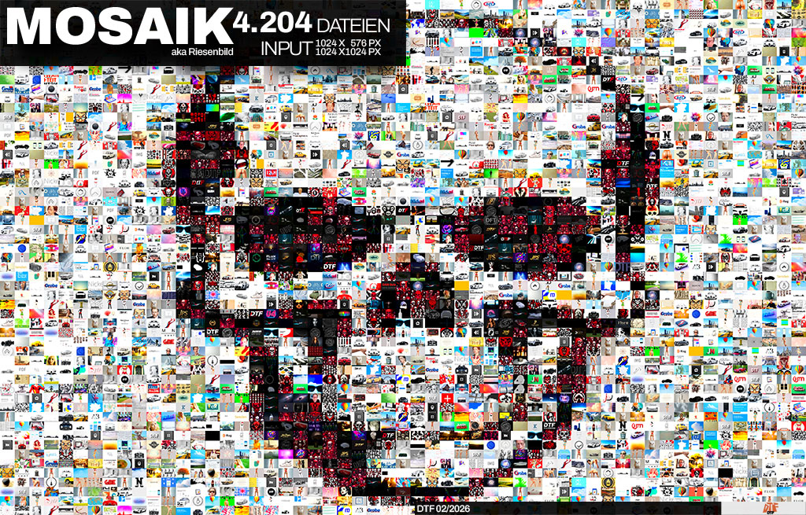

# Mosaic Generator aka Riesenbild

Ein leistungsstarker **Python Mosaic Generator**, der aus tausenden Einzelbildern ein großes Mosaik erzeugt.  
Die Form des Mosaiks wird durch eine **Maske** gesteuert, die **automatisch und robust** aus verschiedenen Ordnern geladen wird.

---
## ✨ Features
- 🧠 Maskenbasiertes Rendering
- ⚡ GPU-Beschleunigung (CUDA / PyTorch)
- 🎯 Unique-Modus (jedes Bild max. einmal)
- 🎨 Farb- & Kontrastkorrektur
- 🔍 Preview- & High-Quality-Modus
- 🧪 Debug-Ausgaben

---
## 📂 Projektstruktur (empfohlen)
project/
│
├── riesenbild.py
├── input/             # Quell-Bilder
│   ├── xxx.jpg
│   ├── yyyy.png
│   └── ...
├── mask/              # Masken (optional)
│   └── maske.png
├── ergebnis.png
└── README.md

🧠 Maske
# Unterstützte Pfade
- --mask maske.png
- --mask mask/maske.png
- --mask masks/maske.png
- --mask C:\bilder\maske.png

# 🚀 Schnellstart
- python riesenbild.py --mask maske.png --output ergebnis.png

### ⚙️ Kommandozeilenoptionen (VOLLSTÄNDIG)
## 🧾 Pflichtparameter
# Option	Beschreibung
- --mask <datei>	        Maske (automatische Suche: Projekt, input/, mask/, masks/, absoluter Pfad)
📁 Input / Output
# Option	Beschreibung
- --input-folder <pfad>	Ordner mit Mosaik-Bildern (Standard: input/)
- --output <datei>	    Ausgabedatei (PNG/JPG)
🖼️ Mosaik & Geometrie
# Option	Beschreibung
- --tile-size <px>	    Kantenlänge eines Tiles in Pixeln
- --unique	            Jedes Bild wird maximal einmal verwendet
- --preview	            Schneller Vorschau-Modus (kleinere Tiles)
- --high-quality	        Maximale Qualität (größere Tiles, langsamer)
- --no-edge	            Deaktiviert Kantenerkennung (Maske wirkt nur als Helligkeitsmaske)

👉 Hinweis zu --no-edge:
Standardmäßig analysiert das Skript Kanten & Kontraste der Maske, um scharfe Übergänge zu erzeugen.
Mit --no-edge wird diese Analyse komplett abgeschaltet.

🎨 Farbe & Tonwerte
# Option	Beschreibung
- --saturation <faktor>	Farbsättigung (z. B. 1.2)
- --vibrance <faktor>	    Vibrance-Verstärkung
- --black-level <wert>	Schwarzwert (0–255)
- --white-level <wert>	Weißwert (0–255)
- --no-color	            Keine Farbkorrektur anwenden
⚡ Performance
# Option	Beschreibung
- --batch-size <n>	    Batch-Größe für GPU/CPU
- --cpu	                Erzwingt CPU-Modus (kein CUDA)
🧪 Debug & Analyse
# Option	Beschreibung
- --debug	                Zusätzliche Debug-Ausgaben
- --debug-mask	        Gibt die verarbeitete Maske separat aus

### 🔍 Beispiele
# Unique + High Quality
- python riesenbild.py --mask maske.png --unique --high-quality
# Vorschau ohne Farbe
- python riesenbild.py --mask maske.png --preview --no-color
# Ohne Kantenerkennung (glatter Look)
- python riesenbild.py --mask maske.png --no-edge
# High Quality + Unique + No Edge
- python riesenbild.py --mask maske.png --high-quality --unique --no-edge

### 📦 Abhängigkeiten
pip install numpy pillow scipy torch torchvision

## CUDA optional, aber empfohlen.

# 🧾 Lizenz
MIT License

Ergebnis
Ein robustes, fehlertolerantes Mosaik-System bereit für große Datensätze.
Anwendung auf eigene Gefahr!
